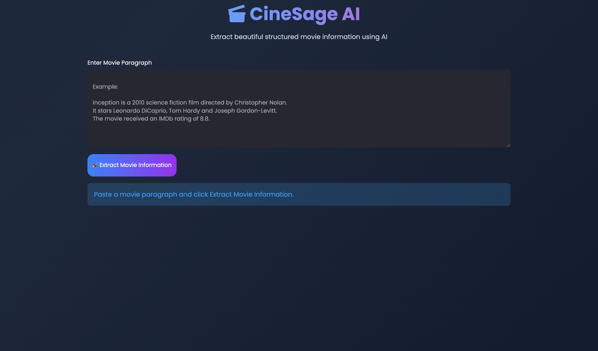
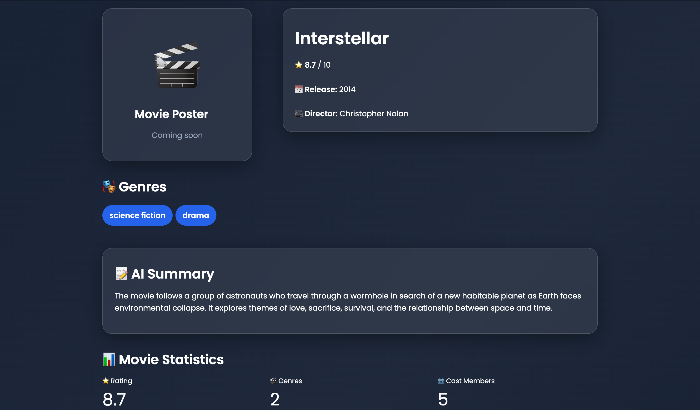
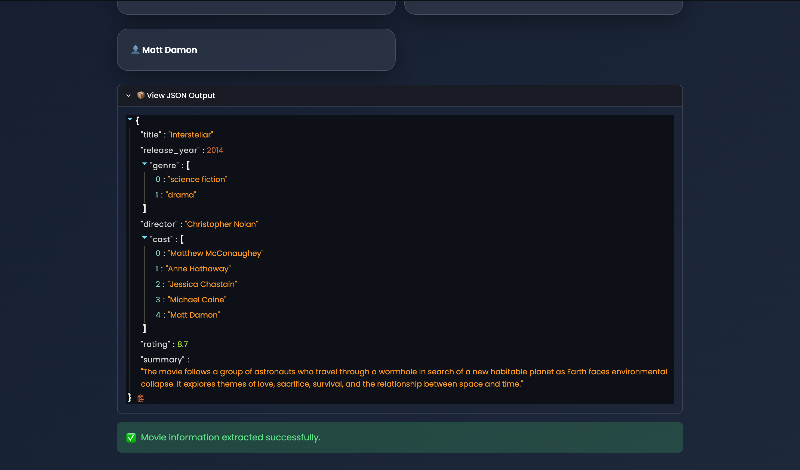

# 🎬 CineSage AI

An AI-powered Movie Information Extractor built using Mistral AI, LangChain, Pydantic, and Streamlit.

## Features

- Movie Information Extraction
- Structured JSON Output
- AI Summary
- Modern Streamlit UI
- Pydantic Validation

## 📸 Application Preview

### 🏠 Home Screen

---

### 🎬 Movie Information Output

---

### 📦 Structured JSON Output

## Tech Stack

- Python
- Streamlit
- LangChain
- Mistral AI
- Pydantic

## Installation

pip install -r requirements.txt

streamlit run cineSage/pydantic_ui.py
